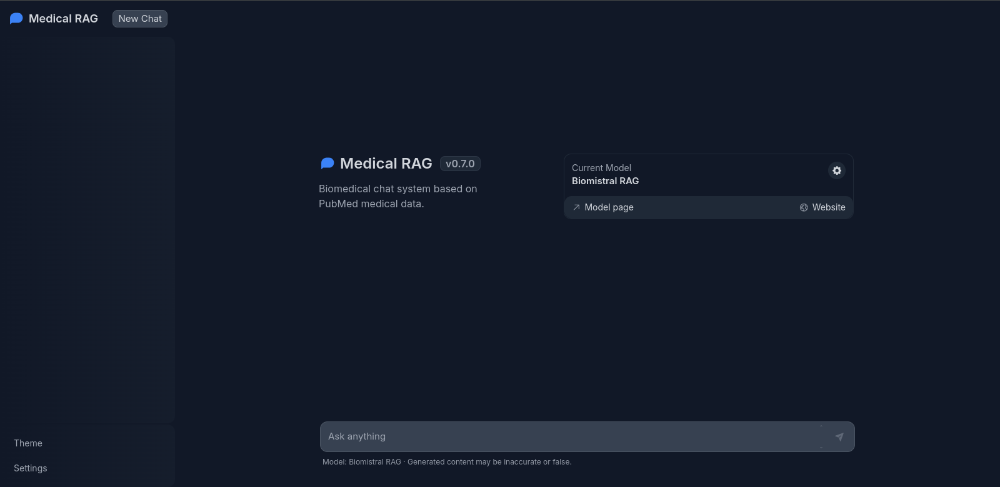
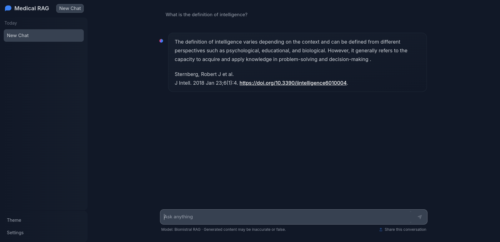

# Medical Chatbot using finetuned LLM and RAG on Pubmed dataset

|                   | GitHub Handle | E-Mail                       | Course of Study           | Matriculation Number |
| ----------------- | ------------- | ---------------------------- | ------------------------- | -------------------- |
| Jonas Gann        | @J-Gann       | gann@stud.uni-heidelberg.de  | Data and Computer Science | 3367576              |
| Christian Teutsch | @chTeut       | christian.teutsch@outlook.de | Data and Computer Science | 3729420              |
| Saif Mandour      | @saifmandour  | saifmandour@gmail.com        | Computer Science          | 4189231              |

Advisor: Robin Khanna

## Introduction

This text serves as documentation for a final project as part of the course "Natural Language Processing with Transformers" at Heidelberg University.
The objective as stated in the project description was to develop a domain-specific question-answering (QA) system either using a medical or legal domain. Given natural language input from the user, the system should be able to generate natural language answers based on relevant documents from a document corpus. The system should be capable of answering a variety of question types and also provide a user interface.

The focus of the project lies on leveraging large language models (LLMs) for context specific tasks. Although the increase in quality of large language models in the past years is astonishing in itself, it is always worthwhile to take a look at how their capabilities can be used to solve real-life problems. There are many examples of successful application of text-based generative models. Usually this is possible "out-of-the-box" however adaptation to a given use case can lead to better results. Common approaches are "finetuning" of existing models and context enrichment from relevant data-sources using "retrieval augmented generation" (RAG).

Often these approaches are used separately, however in this project we utilize a LLM finetuned on biomedical data in combination with a RAG system based on a corpus of medical scientific papers. As will be demonstrated later in this text, LLMs which are finetuned on a context can be nicely expanded by a RAG system of the same context, combining general context knowledge gained during finetuning with more specific knowledge gained through document retrieval by the RAG system.

In the following report we will first give an overview of existing work which is relevant for the project. After that we will give a detailed explanation of the developed system and its components. Finally, we will present the final results and give an outlook on possible improvements and future work.

## Related Work

This section presents previous work, relevant for our project. As this was a software development project with the goal of a "finished product", we heavily used and combined existing models and software. Therefore we will focus on the description of these tools and only briefly cover the underlying scientific work.

Lewis et al. Introduced the RAG approach for natural language processing (NLP) tasks in a specialized field like the medical topic of our project[^13]. RAG combines the strengths of information retrieval (IR) and generative models, allowing for more accurate and contextually relevant outputs. The system uses an IR component to retrieve relevant information from a vector database, which is then used to augment the input to a LLM.  
The idea of using vectors to represent documents is not new and was utilized in the context of information retrieval long before. Salton et al. introduced a vector space model for automatic indexing as early as 1975[^14]. The vector space model (VSM) represents documents in a high-dimensional space, with each dimension corresponding to a term in the vocabulary. The value in each vector represents the frequency of the corresponding term.  
The concept of representing words or documents as vectors has evolved over time. Tomas Mikolov et al. Introduced the Word2Vec algorithm, which is a neural network-based approach for learning word embeddings from large text corpora[^15]. The key idea behind Word2Vec is to train a neural network to predict the context of a word based on its surrounding words in a sentence. The resulting word embeddings capture the semantic relationships between words.  
Jeffrey Penning et al. introduced a similar approach in their paper[^16]. The key idea behind GloVe is to learn word embeddings by capturing the co-occurrence statistics of words in a corpus. The algorithm constructs a co-occurrence matrix that represents the frequency of word pairs occurring together in a context window. This matrix is then factorized to obtain word embeddings that capture the semantic relationships between words.
These are two examples how to embed language into a vector representation. These word embeddings can be stored in the vector database like Pinecone[^5] or Opensearch[^6] where a similarity measure, such as cosine similarity or Euclidean distance, is used to compute the similarity between the query document and each document in the database. A k-Nearest Neighbors (k-NN) algorithm is applied to the computed similarities to retrieve the k most similar documents to the query document. The k nearest neighbors are the documents with the highest similarity scores.

Touvren et al. trained large transformers on large quantity of textual data and made the models publicly available to the research community[^17]. Transformers are an groundbreaking architecture introduced by Ashish Vaswani et al.[^18]. The key innovation in the Transformer architecture is the use of self-attention mechanisms, which allow the model to focus on different parts of the input sequence when generating the output sequence. Parallel processing of the input sequence enabled the training of models on massive datasets, as demonstrated in[^17].
The availability of open-source models has encouraged the development of streamlined tools like Ollama[^8], designed to run these models locally. Ollama provided access to BioMistral, a model which was introduced by Morin et al.[^19]. BioMistral is based on Mistral, a 7-billion-parameter llm introduced by Jian et al.[^20]. Despite having fewer parameters, it outperforms high-performing language models like Llama 1 and Llama 2, which have 13 billion and 34 billion parameters, respectively. Morin et al. fine-tuned their model on the free-accessible PubMed Central database which contains wide range of scientific research articles from the MEDLINE database[^1]. The United States National Library of Medicine (NLM) at the National Institutes of Health (NIH) maintains the MEDLINE database as part of the Entrez system of information retrieval.

To make our RAG system accessible for users, we take advantage of Hugging Face, an open-source community focused on NLP and machine learning (ML). Hugging Face offers a chat interface called Chat-UI, the source code is accessible and can be customized[^12]. Chat-UI is build by SvelteKit, a framework for building web applications and websites using the Svelte framework[^21]. It provides a range of features for building web applications, including a compiler that generates highly optimized JavaScript code, a component-based architecture, and a reactive data store.

Another important technology we used is Docker, a platform for developing, shipping, and running applications using containerization[^22]. A Dockerfile contains instructions for building a Docker image. The Docker image is a standalone package that contains the application and all of its dependencies. An instance of the image can be run as a Docker container on a host machine. This process simplifies the running of an application due to the pre-definition of dependencies, which is a common problem when running an application on another host machine.

## Methods and Approach

In this section we present the developed system in detail, discuss design choices and mention problems and pitfalls we noticed. We will describe the retrieval, preprocessing and storage of the data. We also go into detail about our utilization of pretrained LLMs, how we designed and incorporated a RAG system and how we finalized the system with a user interface. Finally we will briefly go over methods and tools we used during development.

### Overall Design Choices

In this project we focused on delivering a finished project which could actually be useful in its intended domain. Therefore we decided to not approach the project as a research project but as a software development project. This means we focused on the development of a system which is capable of answering questions in the medical domain. We did not focus on the development of new models or algorithms but rather on the integration of existing models and tools. We also focused on the possibility of future expansion of the code by using open-source tools and adding new features in an expandable way. With regards to the behaviour of the answer generation we favoured simplicity, consistency and reliability instead of the highest possible answer quality.

### Data Retrieval

We decided to focus on the medical domain for this project. As part of the project description we were guided to use data from PubMed[^1] and limit ourselves to papers containing the word "intelligence" in either the abstract or the title and a publishing date between 2013 and 2023. At the time of writing, this resulted in 63.508 papers. We initially tried to download the relevant papers using Biopython[^2] but noticed a datacap of 10.000 papers, which was well below our needs. We then discovered EDirect[^3] [^4], a unix command line utility covering the same functionality but without the datacap. Instead of the standard XML format we decided to use Medline as it turned out to be more convenient for us to work with and required less disk space. We used the following command to download the relevant papers.

```shell
./esearch -db pubmed -query "intelligence[tiab]" -mindate 2013 -maxdate 2023 | ./efetch -format medline > ./pubmed_data
```

### Data Preprocessing

As mentioned in the previous section, we already filtered the data to be published between the year 2013 and 2023. Additionally we limit the content of the papers to be about intelligence by filtering all papers which do not contain the term "intelligence" either in the title or in the abstract. We also require papers to contain at least the following data, which we later use in the system: ID, Title, Author, Publication-Date, Abstract, Source. Out of the 63.508 papers, 4.339 do not meet these requirements, resulting in a final dataset of 59.169 papers.

### Vector Storage

In order to query relevant papers for a given user question, we decided to compute an embedding for each paper. These embedding store the semantic content of a paper in form of a vector. One can calculate the cosine similarity between embeddings of the paper-abstracts and the embedding of a user question to find papers with similar content to the question. To further improve the semantic content of the embedding, one could not only incorporate the abstract of the paper into the embedding but also relevant metadata such as the names of the authors as well as the publication date.
Once embeddings are pre-computed for all papers, they can be used to find relevant papers for all coming user questions by computing their embedding similarity. There exist specialized software tools which make these computations easy and efficient. One of the so called "vectorstores" is Pinecone[^5]. It enables cloud storage of embeddings and provides an API for easily querying the top-k most similar embeddings for a given user question.
The alternative to a fully hosted service such as Pinecone is to use a locally running system like OpenSearch[^6]. It is highly customizable and enables storing embeddings with the sources. The REST API makes is easy to query the top-k similar embeddings and because it runs locally it runs much faster than for document retrieval and later references.

<!-- MORE about OpenSearch -->

### Data Storage

As the vector storage is only used to store the embedding values, we need a way to load the dataset containing all the abstracts and metadata. The dataset with 59.169 papers has a total of 260 MB. We decided to not use a database but to write a REST server, which loads the whole dataset into memory on startup and stores the papers in a dictionary with the paper ID as key. Once started, the server hosts an endpoint which consumes a string as input, and responds with the content of the most similar paper. We decided to implement this functionality as a server in order to be able to implement this feature using Python but also enable its usage in the user interface which is written in TypeScript.

### LLM Model

As we want to develop a system capable of understanding and generating natural language, we use a large language model at the hear of our system. We tried many different models and hosting solutions and found out, that BioMistral[^7] in combination with Ollama[^8] worked best in our case. Ollama proved to be very easy to install and setup and due to its quantized models answer generation was very efficient. We also tried to develop a "plug-and-play" solution for HuggingFace models using LangChain[^9] and LangServe[^10] but were challenged with severe problems due to lack of documentation of LangChain and LangServe as well as poor answer quality due to some misbehavior in the interactions of HuggingFace models and LangChain pipelines.

In the context of Ollama we tried a variety of models for answer generation. Well known models like Llama 2 and Mistral worked reasonably well but were difficult to adapt to our use case, as they tended to start and end by repeating colloquial phrases. We did not find suitable model configuration parameters or system prompts to alleviate this problem. Another issue was, that in case no suitable paper was found by the RAG system, these models were not able to generate answers of the same quality.

This was the reason why we decided to search for language models which were finetuned in medical context in the hope that they will be able to bridge the gap of cases where the RAG system does fail to find relevant papers. We also hoped, that such models also reflect the precise and professional writing style from scientific papers in the formulation of their answers.

We found BioMistral to be a perfect fit and fulfill all our expectations. Due to the finetuning, the model is able to accurately and professionally answer medical questions on its own as well as competently include additionally information provided by the RAG system.

We eventually settled for the following system prompt for the BioMistral model:

```js
"You are a medical assistant. Answer questions truthfully. Base your answer soley on the given information.";
```

### RAG System

Main part of the RAG system is the retrieval of relevant papers for a given user question, which was already introduced as part of the section "Vector Storage". Next to the paper content, the server also includes the similarity score in its response. In case the similarity score is higher than 0.5 (a value we defined after some experiments) the abstract of the paper is inserted into the user prompt as follows:

```js
`=====================

CONTEXT:

${abstract}

=====================

${userQuestion}`;
```

If the score is below 0.5, the string "No context available." is inserted instead.

We made the design choice to only retrieve and use the most similar paper. The reason is, that in case of multiple papers being inserted in the prompt, we were not able to instruct the llm model to generate a self-contained answer which met our expectations. Instead the answers would usually be a list of summaries of each paper abstract. We were not satisfied with this behavior and decided a consistent answer based on one paper was more appropriate than a list of summaries of relevant papers.

As we wanted the model to be aware of the chat history we included the previous user questions into the prompt:

```js
`=====================
  
${previousQuestions}

CONTEXT:

${abstract}

=====================

${userQuestion}`;
```

This enables the model to better understand the intention of the current question of the user. An interesting extension would be to also include previous answers of the model. In that case one would have to make sure, that the prompt does not get too large.

As we only use at most one paper for a question, we were able to manually append the source of the paper to the answer of the model. We experimented with different prompt statements instructing the model to automatically insert a reference to the paper where appropriate but did not find a solution which worked consistently. It would be very interesting to go through current research and incorporate promising approaches into the system.

### User Interface

We decided to not write a custom user interface as there were many open-source user interfaces available for the use case at hand. We initially looked at user interfaces in the context of Ollama such as Open WebUI[^11]. However this turned out not to be sufficiently expandable in order to incorporate our RAG system. Therefore we decided to use the extensively customizable Chat-UI[^12].

Here we were able to not only customize the models available to the user in a configuration file but also insert custom code, adding new features to the answer generation pipeline. This most notably concerns the ["buildPrompt.ts"](./chat-ui-rag/src/lib/buildPrompt.ts) file in which the main logic regarding the enrichment of the user prompt is contained. Here we added the option to insert papers retrieved by the RAG system as described in the previous chapter. We added a "rag" configuration option to the [".env"](./chat-ui-rag/.env) file to enable the integrator to turn the RAG system on and off. Additionally we wanted the vector store to also be replaceable as we saw no need to hardcode the usage of Pinecone. Thats why we added the option "vectorStoreType" as well as "url" to enable configuration of different vector stores. To use a different vector store one would have to implement an adapter for the new vector store and implement the corresponding endpoint similar to the ["PineconeEndpoint](./chat-ui-rag/src/lib/server/rag/pinecone/pineconeEndpoint.ts) and add a new case to the ["RAGEndpoint](./chat-ui-rag/src/lib/server/rag/ragEndpoint.ts). This way we provided two vector stores: Pinecone and OpenSearch.






## Collaboration

We decided to only run the mongo database in a docker container and the nodejs application locally. Because of the complexity of the project much of the time went into implementing the RAG and little time was left to make a docker container for the nodejs[^23] application. The Docker file can still be found `chat-ui-rag/Dockerfile`, but it didn't run as intended, because the build files weren't found. Nodejs is an opensource javascript framework which allows server-side javascript execution. A useful feature is `npm run dev`, which allows a development server to run locally for testing the application. However, we tested running the application in production. We decided to use the resource manager pm2 to run the application. We chose pm2[^24] because it allows the npm application to run as a daemon allowing the application to be easily deployed on a web server with using apache2[^25] for example.

### Development


The development process started locally with jupter notebooks to test data retrieval and data preprocessing. This went without any computational limits. However when the Question Answering phase started, we had to look for GPU machines to handle running models like llama for example. Google Colab's T4 GPU didn't suffice, so we opted for renting a GPU machine on paperspace[^26]. This step allowed us to experiment with different models like llama and biomistral with much quicker responses than locally. We used github for version control and issue tracking.

## Experiments

### Data

The data was retrieved as described in the Data Retrieval section. Each entry contains 20 different meta-information fields. We decided to use the unique PubMed identification PMID to identify our documents in the vector database. The abstract (AB) is used to generate the word embedding to calculate similarity between documents and the question query. We also provide the source (SO) by concatenating it with the first author's (FAU) name. Additionally, we save the title (TI) and the date of publication (DP).

### Evaluation Method

We used three different evaluation settings.

1. Generation of PubMed related questions and answers (QA's)

The QA's pairs are related to the word "intelligence" in the abstract. We used Chat-GPT to generate both questions and answers. We used the answers for the same questions to compare the answers of our RAG system. To do that, we calculate the word embeddings of both answers and calculate the similarity. This is done with the Python scripts answerEmbedding.py and answerSimilarity.py from the /QA-INLPT-WS2023/evaluation folder. The information is stored in QAs.json, and the results are shown in Table 1. We also check the retrieval score the generated question of the RAG system.
Note, we use a retrieval score threshold to filter sources with a lower retrieval score. 

2. Generated unrelated QA's

We used QA's pairs that are unrelated to a medical context to assess how the BioMistral model, fine-tuned on PubMed data, performs. We are interested in whether the Q&A pairs found reasonable answers and if the RAG system found a source. The results are shown in Table 2.

3. Sentiment analysis

We compared the sentiment analysis of questions that should be answered with either Yes (positive) or No (negative). The results are shown in Table 3.

### Experimental Details

We used the following prompts to generate the QA's in Chat-GPT. Furthermore we set the retrieval score threshold to 0.4. This means that we don´t provide the user a source link if the retrieval score is less than 0.4.

1. Generation of PubMed related QA's

We generated the PubMed related QA's with the following prompts.

User: "Are you familiar with PubMed dataset?"
User: "Generate 20 questions about the topic of intelligence in a medical context which a medical assistant can answer. "
User: "You are a medical assistant. Answer questions truthfully. Base your answer solely on PubMed data."

2. Generated unrelated QA's

We generated the PubMed unrelated QA's with the following prompts.

User: "Are you familiar with PubMed dataset?"
User: "Generate 5 question which has nothing to do with PubMed or any other medical topic."
User: "Can you answer the 5 questions?"

3. Sentiment analysis

We generated the sentiment analysis QA's with the following prompts.

User: "Are you familiar with PubMed dataset?"
User: "Generate 20 questions about the topic of intelligence in a medical context which a medical assistant can answer. "
User: "You are a medical assistant. Answer questions truthfully. Base your answer solely on PubMed data."
User: "Can you provide 10 questions and answers which have a positive or negative answer? It must be possible to answer with yes or no."

### Results

1. Generation of PubMed related QA's

We calculated the similarity of the answers for all questions. The retrieval score was logged together with the answers. Note that the unanswered questions are due to a key error. We updated the source information later, and it was not filtered when we created the database. So, it could be that a document from the vector database has the highest score but no source. If this is the case, we get an error in the pinceoneEndpoint.py function where we filter documents without a source. However, we decided to leave the results in the test data to do a countercheck. We plan to update the vector database before the submission deadline.

In the next section, we compare the answers of RAG and Chat-GPT. The results are stated in the table. We classify the answers as follows:

- Correct: The answer makes sense.
- Unprecise: The answer refers to the right topic but is not precise.
- Incorrect: The answer is the abstract or is related to the wrong topic.
- Differs: Both answers are stating the opposite.
- Aborted: The answer generation was apported.

Table 1: Results of PubMed related QA's
| Question  | Chat-GPT |   RAG    | Similarity | Score | 
| --------- | -------- | -------- | ---------- | ----- |  
|     1     |  correct | correct  |    0.80    | 0.69  |    
|     2     |  correct |unprecise |    0.75    | 0.63  |     
|     3     |  correct |   error  |   -0.12    |       |  
|     4     |  correct |   error  |   -0.05    |       |   
|     5     |  correct |   error  |   -0.11    |       |     
|     6     |  correct |incorrect |    0.68    | 0.71  |         
|     7     |  differs | differs  |    0.80    | 0.73  |         
|     8     |  correct |incorrect |    0.68    | 0.73  |         
|     9     |  correct | correct  |    0.80    | 0.72  |         
|    10     |  correct | correct  |    0.66    | 0.69  |         
|    11     |  correct | correct  |    0.76    | 0.62  |         
|    12     |  correct | correct  |    0.67    | 0.62  |         
|    13     |  correct |unprecise |    0.82    | 0.74  |         
|    14     |  correct | correct  |    0.84    | 0.73  |         
|    15     |  correct | correct  |    0.85    | 0.71  |         
|    16     |  correct | correct  |    0.87    | 0.63  |         
|    17     |  correct | aborted  |    0.64    | 0.70  |         
|    18     |  correct | correct  |    0.85    | 0.61  |         
|    19     |  correct | correct  |    0.72    | 0.68  |         
|    20     |  correct |   error  |   -0.09    |       |         
|    21     |  correct |unprecise |    0.62    | 0.67  |         
|    22     |  correct | correct  |    0.61    | 0.68  |         
|    23     |  correct | correct  |    0.82    | 0.68  |      

2. Generated unrelated QA's

We present the Similarty of the RAG answers, the Retrieval Score and if the Source are over the threshold. We also check by human eye if the answers make sense. 

Table 2: Results of PubMed unrelated QA's
| Question  | Chat-GPT |  RAG    | Similarity | Score | Source |
| --------- | -------- | ------- | ---------- | ----- | -------|
|     1     | correct  | correct |    0.94    | 0.48  |   Yes  |
|     2     | correct  | correct |    0.79    | 0.43  |   Yes  |
|     3     | correct  | correct |    0.86    | 0.36  |    No  |
|     4     | correct  | correct |    0.83    | 0.26  |    No  |
|     5     | correct  | correct |    0.95    | 0.53  |   Yes  |

3. Sentiment analysis

We assume that the same answer results in a Similarity of 1, the opposite 0 and a unsure answer of the RAG with 0.5. 

Table 3: Results of sentiment analysis
| Question  | Chat-GPT |  RAG    | Similarity | Score | Source |
| --------- | -------- | ------- | ---------- | ----- | -------|
|     1     |    Yes   |    No   |    0.0     | 0.63  |   Yes  |
|     2     |    Yes   |   Yes   |    1.0     | 0.70  |   Yes  |
|     3     |    Yes   |   Yes   |    1.0     | 0.71  |   Yes  |
|     4     |    Yes   |    No   |    0.0     | 0.67  |   Yes  |
|     5     |    Yes   |  Unsure |    0.5     | 0.79  |   Yes  |
|     6     |     No   |    No   |    1.0     | 0.76  |   Yes  |
|     7     |    Yes   |   Yes   |    1.0     | 0.72  |   Yes  |
|     8     |     No   |  Unsure |    0.5     | 0.66  |   Yes  |
|     9     |     No   |    No   |    1.0     | 0.63  |   Yes  |
|    10     |     No   |    No   |    1.0     | 0.77  |   Yes  |

### Analysis

1. Generation of PubMed related QA's

We compare the answers of the RAG and Chat-GPT in the QAs.json file. 

       1. Both answers contain the words "problem-solving," "reasoning," and "ability to learn." However, RAG mentioned that there is no single agreed-upon definition of intelligence in a medical context, while Chat-GPT defines it in the answers.
       2. The answer of RAG refers to the measure of intelligence in an admission process of a medical school, while Chat-GPT is more general and refers to measuring intelligence with an IQ test.
       3. No RAG answer
       4. No RAG answer
       5. No RAG answer
       6. RAG cites the same source as in question 2. However, the text does not really summarize the abstract and seems that the source document is not really related to the question. It's more about if specific jobs in medicine need more intelligence, which will be asked later. The Chat-GPT answer is short and precise.
       7. Opposite answers. RAG states that it is possible to improve or maintain intelligence of children. Chat-GPT states that it is not possible to improve intelligence, only maintaining intelligence is possible by activating cognitive function with games, reading, etc. It is noticeable that the similarity value is high, even though the answers are opposite. This is a good example of why it's hard to compare the semantics of sentences. The words are similar, but a small negation can change the whole context. 
       8. RAG does not answer the question and just prints the abstract of the highest scored document. However, the abstract is on the right topic. It's about research on the change of intelligence by aging. The answer from Chat-GPT goes in the same direction but is shorter.
       9. Both answers are similar.
       10. Both answers are similar but RAG gives more details. 
       11. Both answers are similar and refer to non-pharmacological methods to improve aspects of cognition.
       12. Both answers are similar. 
       13. RAG gives exactly the same answer as in Question 6. But by checking the source, one can see that it is not the abstract. Here we have to double check why the same answer is generated and why it does not look like a summary. However, the topic is correct. Chat-GPT answers short and precise.
       14. Both answers are similar.
       15. Both state that intelligence is associated with better decisions. RAG, however, focuses more on empathy in the decision-making process, while Chat-GPT seems to refer more to an analytical decision-making process.
       16. Both answers state that it is possible to quantify intelligence. RAG refers to the SAT, ACT, and GRE tests, while Chat-GPT refers to more well-known IQ tests.
       17. The answer was not generated completely and seems to have been aborted in between. However, the topic of the referred document is correct. The Chat-GPT answer is similar.
       18. Both answers are similar.
       19. Both answers are similar. 
       20. No RAG answer
       21. RAG provides a long answer that is not the abstract of the source. The RAG answer is indecisive and refers to studies with opposite results. It also refers to BMI and not the example disease cardiovascular disease or metabolic disorders from the questions. Chat-GPT answers confidently why these diseases can affect intelligence.
       22. RAG is again more detailed in the answer. However, both answers are similar. 
       23. Both answers state that intelligence and cognitive functions differ. 

Upon visual inspection, it became evident that the similarity measure is not a reliable indicator for analyzing the semantic content of the QA system. A notable instance is question 7, where despite a high similarity value of 0.8, the answers contain opposing statements. However, the similarity measure can still be used as an initial filter to determine if the answers share common words, which may suggest a shared topic.

2. Generated unrelated QA's

   1. Both answers are similar, but RAG is more detailed. It also refers to a source with a retrieval score of 0.48. However, the two answers' similarity is higher than all similarities from the related Q&A's. Both answers start with the same eleven letters, which can influence the high similarity score. Also interesting to note is that the provided source document for the RAG is about the workspace of a radiologist, and home office is not mentioned. But both productivity improvement strategies might be similar.
   2. Both answers are similar, with a similarity score of 0.79. It turns out that the retrieved document has good information to generate an answer, even if the retrieval score is relatively low. The RAG answer is more detailed than the Chat-GPT answer, but both mention similar topics.
   3. Similar to question 2, the similarity score of the two questions is high. And also the retrieval score is quite low, but the provided answer is detailed and correct.
   4. Both answers refer to the Roman Empire. We checked the recommended authors and book titles. The author Susan Wise Bauer and the book title recommended from Chat-GPT exist. The author Paul Erdkamp recommended from RAG exists, but we didn't find the book. Only books which are related to the Roman Empire but with other titles. Again RAG is more detailed and recommend other authors as well. Were some exist and some not.
   5. Both answers are similar with a similarity score of 0.95. Also the retrieval score higher than the other unrelated questions.

We presume that BioMistral can produce accurate answers to non-PubMed-related data due to its foundation in the underlying Mistral model. It's intriguing to note that the similarity tends to increase with lower retrieval scores. We believe this is because the model incorporates more information from the Mistral model when the retrieved document doesn't supply sufficient information for the given question. It's also noteworthy that the retrieval scores for the generated unrelated QA's are consistently lower than those for the related ones. This indicates that we have correctly generated the QA's, even if they are occasionally tangentially related to medical topics.

3. Sentiment analysis

We observe that 4 out of 10 questions are answered differently.
In question 1, RAG mentioned that it is not possible to improve intelligence through education and cognitive training. This is interesting because RAG answered question 7 from related QA's in the opposite way. In question 4, it's asked if it is possible to accurately measure intelligence using standardized tests. We think that in this case, RAG is correct in answering the question with no, which means that Chat-GPT is wrong. In question 5, RAG is unsure whether to give a true or false answer. The question is whether socioeconomic factors influence intelligence. We think RAG is correct because it's not really easy to state a yes or no answer to this question. Question 8 asked if intelligence is a fixed trait that remains constant throughout. We again side with RAG and think that the answer is too complex to answer with a simple yes or no.


## Contributions

|                   | Data Retrieval | Data Preprocessing | Data Storage | LLM Model | RAG System | Document Reference | User Interface | Experiments |
| ----------------- | -------------- | ------------------ | ------------ | --------- | ---------- | ------------------ | -------------- | ----------- |
| Jonas Gann        |                |                    |              |           |            |                    |                |             |
| Christian Teutsch |                |          x         |       x      |           |     x      |                    |                |      x      |
| Saif Mandour      |                |          x         |       x      |     x     |            |        x           |                |      x      |

### Jonas Gann

At the beginning of the project I retrieved the data from PubMed and did some experiments how to use embeddings to calculate the similar papers for a given question. I eventually found a working method but still decided to use Pinecone as a vector store and implemented the required API calls. I then started looking into the answer generation using various kinds of methods and LLMs and eventually decided one of the more powerful instruct-models to be the best fit for our use case. During this time I also had to find a way to run the LLMs which led me to test Ollama for my local machine and Google Colab as well as Paperspace for remote GPU computing. Ollama turned out contain very performant models generating good quality answers. So I moved on using Ollama. The next step was to integrate relevant papers into the user prompt. I tried different approaches and prompts which lead to suboptimal behavior but were satisfactory enough to move to the next important feature: the UI. I looked around a bit and found out there were many open-source UIs available for the use case at hand. I decided to use Chat-UI and started to customize it to our needs by integrating the features I previously developed in python notebooks. As the UI is written in TypeScript and I wanted to reuse the python code I settled for the solution of hosting essential features in a REST server. Now that all essential systems were in place I started to iteratively improve each of the system components. This included selection of the superior BioMistral model as well as adjusting the system prompt of the model and the insertion of abstracts into the user prompt. One main challenge was to enable the model to generate references to the papers used in the context. As I found no reliable solution, I manually inserted the references to the papers in the generated answer.

### Christian Teutsch
At the beginning of the project I did some investigations how to parse the PubMed data and found the biopython package as a suitable tool. 
We made an early decision to employ a RAG architecture for our QA system. Prior to our introduction to Pinecone in the fourth assignment, Saif and I familiarized ourselves with Opensearch. We implemented a k-NN index mapping, which I later integrated into our final solution (openSearchEndpoint.py) as an alternative to the Pinecone endpoint. Additionally, I implemented pre-processing in the Opensearch folder. I also made some modifications to the RAG, such as pre-prompting and including metadata like the retrieval score. Saif and I conducted the experiments together, and I analyzed the results. 

### Saif Mandour

Data Proprocessing and Data Storage went hand in hand when implementing a vector database. The first challenge that faced me is how to populate opensearch with the extracted pubmed records. In the notebook `pubmed_preprocessing.ipynb` together with Christian we setup an opensearch instance locally and used the library biopython to extract paper title, author name, date of publication and the abstract. After creating the sentence embeddings for the abstracts and saving them, we faced a challenge of how to populate the `pub_med_index`. For that we wrote a bulk operation that populates the database in one request. For Document retrieval we needed to define a K-Nearest-Neighbor (KNN) query, which we tested for k=5 and got satisfying results.

For the final project we decided to mainly use pinecone as the main vector space. I decided to help looking for the LLM that suits our problem the best. As specified in the `.env.template` file, I tried out different models like Mistral, Llama2 and openchat, which is an LLM based on Llama. At  the end we opted for Biomistral, which is an open source LLM pretrained using Pubmed data. Perfect for our needs. However, we noticed when evaluating the model, that the knowledge cutoff was mitigated by our RAG system.

When working on document referencing in generated answers, I noticed that our model just outputs on the title of the most relevant document and not the source. I looked into the data to find a pattern in the source "SO" of the retrieved documents and decided to create a website link out of it. Each document had a "[doi]" tag in the sources, so replacing it with an http request created a reliable and clean document reference with a website link to read more about the paper. For document reference I mainly worked with `pineconeEndpoint.py`.

To evaluate the chatbot Christian and I generated a list of questions and answers with ChatGPT-3.5 and compared the answers with the answers of our chatbot as specified in the Evaluation section. The evaluation showed us mistakes and improvement potential which will be adressed in the future work section. An obvious problem, was that in the preprocessing phase some document sources weren't collected, which led to an error when trying to reference those document without a source at hand.

Finally I looked into preparing the chatbot for production and setting up the tools needed for that. As specified in the deployment section, I ran into problems with containerizing the whole chatbot into one image, but we managed to let mongodb run in a docker image reliably. 


## Conclusion and Future Work

We were able to develop a working system capable of answering medical questions based on papers retrieved from PubMed. Some shortcomings of our system are, that we were only able to use the most relevant paper for a given question as context for the answer generation. It would technically be no problem to insert more abstracts but one would have to further optimize the model configuration such that the model generates a suitable answer not falling back to a list of paper summaries. We also were not able to automatically insert references to the papers used in the context. This would be a very useful feature and we would be very interested in future research in this area. For actual productive deployment of our system we would also have to perform some additional optimizations such as the implementation of a docker container for the nodejs application and utilization of an actual database for the RAG system.

One possible improvement is preprocessing the pubmed_data while enforcing the source to exist in each document, so we avoid any document retrieval conflicts where the document source does not exist and only the abstract. 


## Anti-plagiarism Confirmation

We hereby declare that the assignment on the
topic mentioned above

1. Is the result of or own independent work,
2. Makes use of no other sources or materials
   other than those referenced, and that
   quotations and paraphrases obtained from
   the work of others are indicated as such.

[^1]: https://pubmed.ncbi.nlm.nih.gov/
[^2]: https://biopython.org/
[^3]: https://www.nlm.nih.gov/dataguide/edirect/install.html
[^4]: https://www.ncbi.nlm.nih.gov/books/NBK179288/
[^5]: https://www.pinecone.io
[^6]: https://opensearch.org/
[^7]: https://huggingface.co/BioMistral/BioMistral-7B
[^8]: https://ollama.com/
[^9]: https://www.langchain.com/
[^10]: https://python.langchain.com/docs/langserve
[^11]: https://github.com/open-webui/open-webui
[^12]: https://github.com/huggingface/chat-ui

[^13]:
    Lewis, Perez, Piktus. Retrieval-augmented generation for knowledge-intensive nlp tasks. Advances in Neural Information Processing Systems, 2020.
    https://proceedings.neurips.cc/paper/2020/hash/6b493230205f780e1bc26945df7481e5-Abstract.html

[^14]:
    Salton, Wong, Yang. A vector space model for automatic indexing. Communications of the ACM, 1975.
    https://dl.acm.org/doi/abs/10.1145/361219.361220

[^15]:
    Mikolov, Chen, Corrado. Efficient estimation of word representations in vector space. arXiv preprint arXiv:1301.3781, 2013.
    https://arxiv.org/abs/1301.3781

[^16]:
    Pennington, Socher, Manning. Glove: Global vectors for word representation. Proceedings of the 2014 conference on empirical methods in natural language processing (EMNLP), 2014.
    https://aclanthology.org/D14-1162.pdf

[^17]:
    Touvron, Lavril, Izacard. Llama: Open and efficient foundation language models. arXiv preprint arXiv:2302.13971, 2023.
    https://arxiv.org/abs/2302.13971

[^18]:
    Vaswani, Shazeer, Parmar. Attention is all you need. Advances in neural information processing systems, 2017.
    https://proceedings.neurips.cc/paper/7181-attention-is-all

[^19]:
    Labrak, Bazoge, Morin. BioMistral: A Collection of Open-Source Pretrained Large Language Models for Medical Domains. arXiv preprint arXiv:2402.10373, 2023.
    https://arxiv.org/abs/2402.10373

[^20]:
    Jiang, Sablayrolles, Mensch. Mistral 7B. arXiv preprint arXiv:2310.06825, 2023.  
     https://arxiv.org/abs/2310.06825

[^21]: https://kit.svelte.dev/
[^22]: https://www.docker.com/
[^23]: https://nodejs.org/docs/latest/api/
[^24]: https://pm2.keymetrics.io/
[^25]: https://httpd.apache.org/docs/2.4/de/
[^26]: https://www.paperspace.com/
